# A Patch-based Method for Underwater Image Enhancement with Denoising Diffusion Models
Binglei Bao, Haisheng Xia, Fei Liao, Jintao Chen, Binglu Wang, Zhijun Li

*This repository introduces the paper: "A Patch-based Method for Underwater Image Enhancement with Denoising Diffusion Models", and includes enhancement results from various public datasets and real-world scene images.*

Abstract: *The enhancement of underwater images has emerged as a significant technological challenge in advancing marine research and exploration tasks. Due to the scattering of suspended particles and absorption of light in underwater environments, underwater images tend to present blurriness and predominantly color distortion. In this study, we propose a novel approach utilizing denoising diffusion models to improve underwater degraded images. After training the noise estimation network of the denoising diffusion models, we accelerate the deterministic sampling process with denoising diffusion implicit models. We also propose a patch-based method by implementing average sampling between overlapping image patches at each sampling step, enabling the generation of images at arbitrary resolution while preserving their natural appearance and details. Through benchmark experiments, we illustrate that our method outperforms or closely approaches state-of-the-art techniques in terms of effectiveness and performance. We demonstrate that our approach reduces the interference of underwater environments with the semantic information of the images by salient object detection experiments.*

## Method
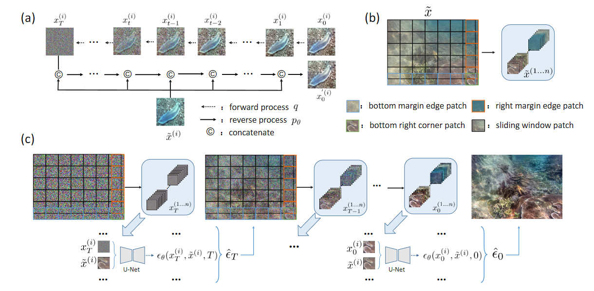
Our patch-based method for UIE with denoising diffusion models. (a) Overview of the forward process and the reverse process of conditional diffusion models. (b) Example of patch segmentation for underwater degraded images $\tilde{\mathbf{x}}$ when the stride of the sliding window is equal to the patch size (in this case, the patches are non-overlapping except for the margin regions). (c) The whole execution process of our methods. We segment both the conditional image $\tilde{\mathbf{x}}$ and each generated image $\mathbf{x}_{1...T}$ at each step into patches. The overlapping patches noise $\bm{\epsilon}_{\theta}$ is merged by mean after the noise estimation network.

## Result
### [RUIE](https://github.com/dlut-dimt/Realworld-Underwater-Image-Enhancement-RUIE-Benchmark)
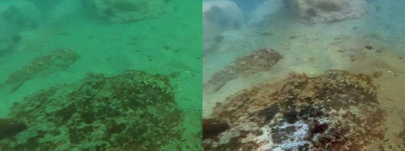
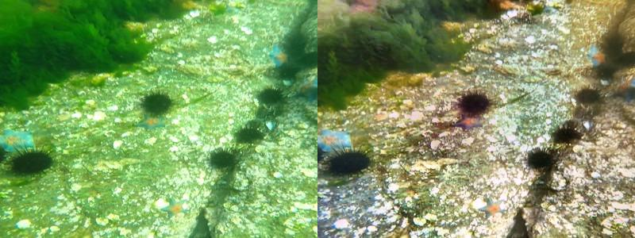
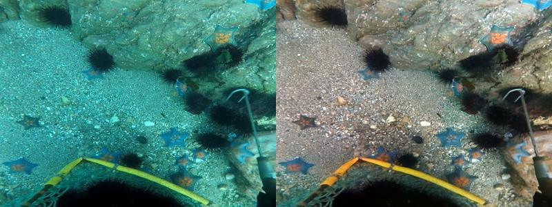
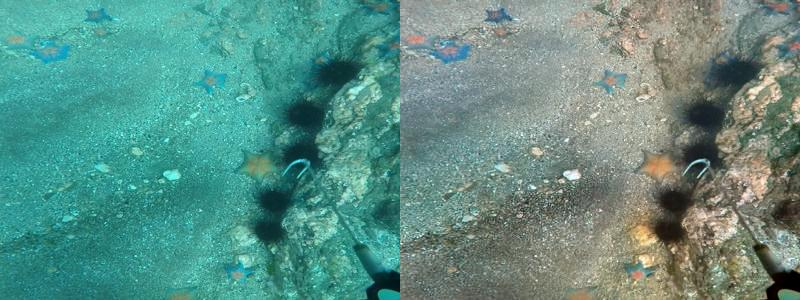
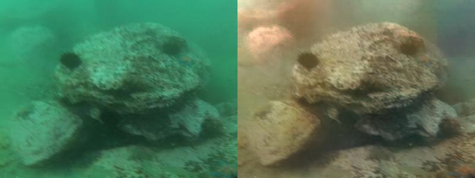
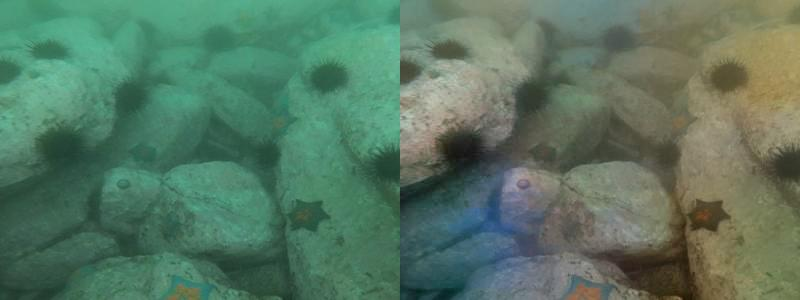
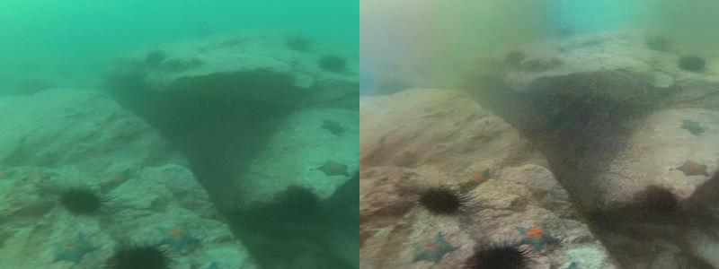
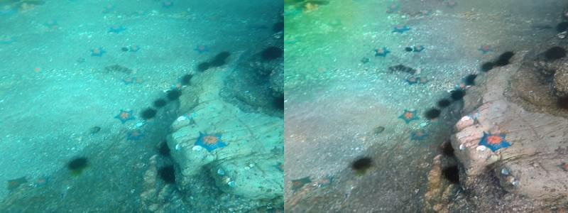
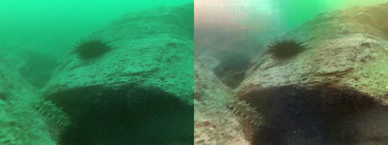

### [UIEB](https://li-chongyi.github.io/proj_benchmark.html)
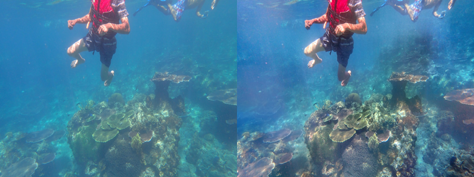
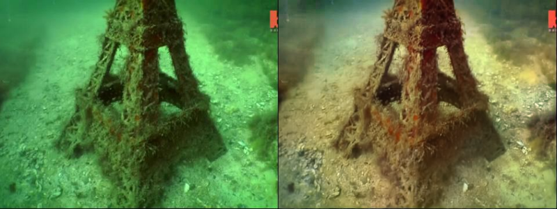
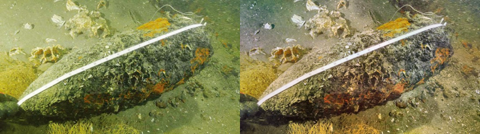
### [EUVP](https://irvlab.cs.umn.edu/resources/euvp-dataset)
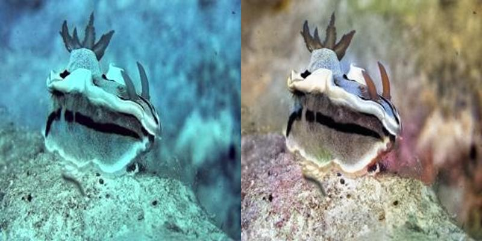
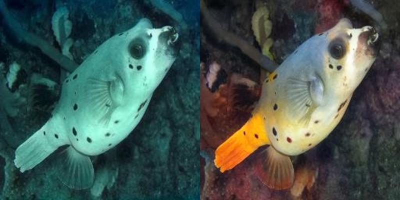
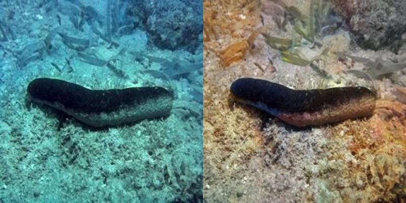
### The Real-world Camera Captures Images
#### Artificial Underwater Scenes
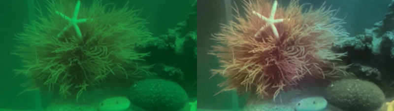
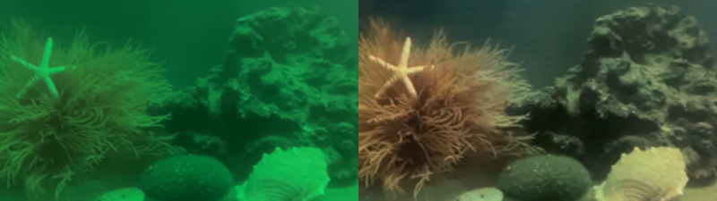
#### Lake AUV Capture

## GIF

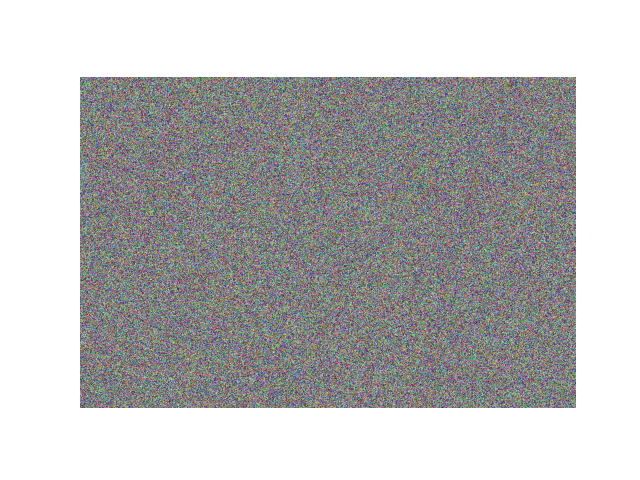

## Preview under different parameters

